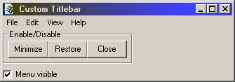



## Change Titlebar Style within your App

### Description

My Code replace the Titlebar within your App.The special about it is that you can choose the colors of the Titlebar.And you can use Menus in your Form.When you like it please vote for me ;-))
 
### More Info
 

             |
---                |---
**Submitted On**   |2000-05-10 20:36:06
**By**             |[J\.\-A\.Mock](https://github.com/Planet-Source-Code/PSCIndex/blob/master/ByAuthor/j-a-mock.md)
**Level**          |Advanced
**User Rating**    |4.8 (29 globes from 6 users)
**Compatibility**  |VB 5\.0, VB 6\.0
**Category**       |[Custom Controls/ Forms/  Menus](https://github.com/Planet-Source-Code/PSCIndex/blob/master/ByCategory/custom-controls-forms-menus__1-4.md)
**World**          |[Visual Basic](https://github.com/Planet-Source-Code/PSCIndex/blob/master/ByWorld/visual-basic.md)
**Archive File**   |[CODE\_UPLOAD56665102000\.zip](https://github.com/Planet-Source-Code/j-a-mock-change-titlebar-style-within-your-app__1-7995/archive/master.zip)

